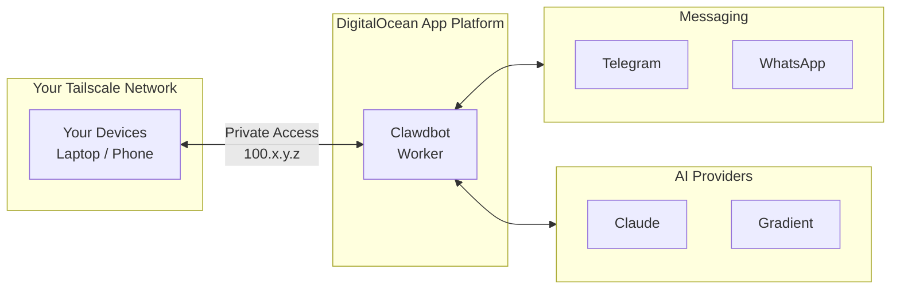
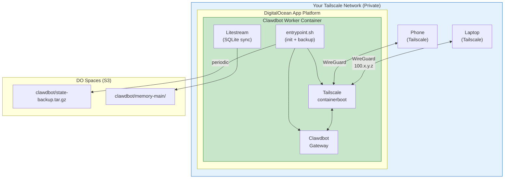

# Clawdbot on DigitalOcean App Platform

Your personal AI assistant, privately accessible via Tailscale.

[](https://cloud.digitalocean.com/apps/new?repo=https://github.com/digitalocean-labs/clawdbot-appplatform/tree/main)

> **Note**: Clawdbot runs as a worker (no public URL) — accessible only through your private Tailscale network.

## How It Works



## Prerequisites

Before deploying, you'll need:

| Prerequisite | Why Needed | Setup |
|--------------|------------|-------|
| **Tailscale Account** | Clawdbot is your personal assistant with access to your accounts. Tailscale ensures only you can access it — no public exposure. | See [tailscale.md](tailscale.md) |
| **DO Spaces Bucket** | App Platform has no persistent storage. Spaces backs up your config, sessions, and Tailscale identity so they survive restarts. | See [spaces.md](spaces.md) |
| **AI Provider API Key** | At least one AI provider (Anthropic, OpenAI, or Gradient) for the assistant brain. | Provider dashboard |

## Deployment Options

Choose your preferred deployment method:

### Option 1: One-Click Deploy (Recommended)

The fastest way to get started.

1. Click the **Deploy to DO** button above
2. Fill in the required secrets when prompted:
   - `TS_AUTHKEY` — Tailscale auth key (see [tailscale.md](tailscale.md))
   - `SETUP_PASSWORD` — Password for the web setup wizard
3. (Recommended) Add Spaces credentials for persistence
4. Deploy and wait for build to complete
5. Access via `https://clawdbot.<your-tailnet>.ts.net` from any Tailscale device
6. Complete setup wizard and configure your first channel

### Option 2: CLI Deploy with doctl

Deploy using the DigitalOcean CLI with full control over configuration.

```bash
# Clone the repo
git clone https://github.com/digitalocean-labs/clawdbot-appplatform
cd clawdbot-appplatform

# Edit app.yaml with your preferences (region, instance size, etc.)
vim app.yaml

# Create the app
doctl apps create --spec app.yaml

# Set secrets via CLI or dashboard
doctl apps update <app-id> --set-env TS_AUTHKEY=tskey-auth-xxx
doctl apps update <app-id> --set-env SETUP_PASSWORD=your-password
```

### Option 3: CI/CD Deploy via GitHub Actions

Deploy from your fork using GitHub Actions (manual trigger only).

1. Fork this repository
2. Add secrets to your fork (Settings → Secrets → Actions):
   - `DIGITALOCEAN_ACCESS_TOKEN` — [Create API token](https://cloud.digitalocean.com/account/api/tokens)
3. Go to Actions → "Deploy to App Platform" → Run workflow
4. The workflow uses `.do/deploy.template.yaml` for configuration

```yaml
# Required GitHub Secrets:
DIGITALOCEAN_ACCESS_TOKEN  # DO API token with read/write App Platform access
```

> **Note**: The deployment workflow is manual-only (`workflow_dispatch`) — it won't trigger automatically on push.

## Architecture



## Environment Variables

### Required

| Variable | Description |
|----------|-------------|
| `TS_AUTHKEY` | Tailscale auth key (see [tailscale.md](tailscale.md)) |
| `SETUP_PASSWORD` | Password for the web setup wizard |

### Recommended (Persistence)

Without these, state is lost on redeploy.

| Variable | Description | Example |
|----------|-------------|---------|
| `LITESTREAM_ACCESS_KEY_ID` | Spaces access key | |
| `LITESTREAM_SECRET_ACCESS_KEY` | Spaces secret key | |
| `SPACES_ENDPOINT` | Spaces region endpoint | `tor1.digitaloceanspaces.com` |
| `SPACES_BUCKET` | Your bucket name | `clawdbot-backup` |

### Optional

| Variable | Description | Default |
|----------|-------------|---------|
| `TS_HOSTNAME` | Hostname on your tailnet | `clawdbot` |
| `CLAWDBOT_GATEWAY_TOKEN` | Admin token for gateway API | (generated) |
| `GRADIENT_API_KEY` | DigitalOcean Gradient AI access | — |

#### Gradient AI Models

When `GRADIENT_API_KEY` is set, you get access to:
- Llama 3.3 70B Instruct
- Claude 4.5 Sonnet / Opus 4.5
- DeepSeek R1 Distill Llama 70B

## Configuring Channels

After deployment, access the web UI at `https://clawdbot.<your-tailnet>.ts.net` and configure channels.

### Telegram (Recommended First Channel)

1. Create a bot via [@BotFather](https://t.me/BotFather) and get your token
2. In Clawdbot settings, add the Telegram channel with your bot token
3. Configure DM policy: **pairing** (approve via code) or **allowlist** (specific users only)
4. Start chatting with your bot

### WhatsApp

1. Access the Clawdbot web console
2. Run `clawdbot channels login whatsapp`
3. Scan the QR code with WhatsApp → Linked Devices
4. Configure allowlist with your phone number

### Other Channels

Clawdbot supports Discord, Slack, Matrix, Signal, and more. See the [Clawdbot documentation](https://docs.clawdbot.com) for setup guides.

## How Backup Works

The container uses two backup mechanisms:

| Data | Method | Frequency |
|------|--------|-----------|
| SQLite (memory/search index) | Litestream | Real-time (~1s) |
| Config, sessions, JSON state | s3cmd tar | Every 5 minutes |

**On startup:**
1. Restores JSON state from Spaces (if exists)
2. Restores SQLite via Litestream (if exists)
3. Starts Tailscale daemon
4. Starts the gateway

**On shutdown:**
Final backup is triggered on SIGTERM for graceful restarts.

## Resource Requirements

| Instance | RAM | Use Case | Cost |
|----------|-----|----------|------|
| `apps-s-1vcpu-1gb` | 1 GB | Default (lightweight usage) | ~$12/mo |
| `apps-s-1vcpu-2gb` | 2 GB | Multiple channels | ~$25/mo |
| `apps-s-2vcpu-4gb` | 4 GB | Heavy usage + browser automation | ~$48/mo |

> **Note**: Start with 1GB and scale up if you see memory issues.

Add ~$5/mo for Spaces persistence.

## Available Regions

| Region | Code |
|--------|------|
| New York | `nyc` |
| Amsterdam | `ams` |
| San Francisco | `sfo` |
| Singapore | `sgp` |
| London | `lon` |
| Frankfurt | `fra` |
| Bangalore | `blr` |
| Sydney | `syd` |
| Toronto | `tor` (default) |

Edit the `region` field in `app.yaml` to change.

## File Structure

```
├── .do/
│   └── deploy.template.yaml  # App Platform deploy button config
├── .github/
│   └── workflows/
│       ├── build-push.yml    # Build & push to GHCR (weekly)
│       └── deploy.yml        # Manual deploy to App Platform
├── app.yaml                  # CLI deployment spec
├── Dockerfile                # Container image definition
├── entrypoint.sh             # Container init & backup logic
├── litestream.yml            # SQLite replication config
├── tailscale                 # Tailscale CLI wrapper
├── tailscale.md              # Tailscale setup guide
└── spaces.md                 # DO Spaces setup guide
```

## Links

- [Clawdbot Documentation](https://docs.clawdbot.com)
- [Tailscale Setup Guide](tailscale.md)
- [DO Spaces Setup Guide](spaces.md)
- [Tailscale Getting Started](https://tailscale.com/kb/1017/install/)
- [App Platform Documentation](https://docs.digitalocean.com/products/app-platform/)

## License

MIT
