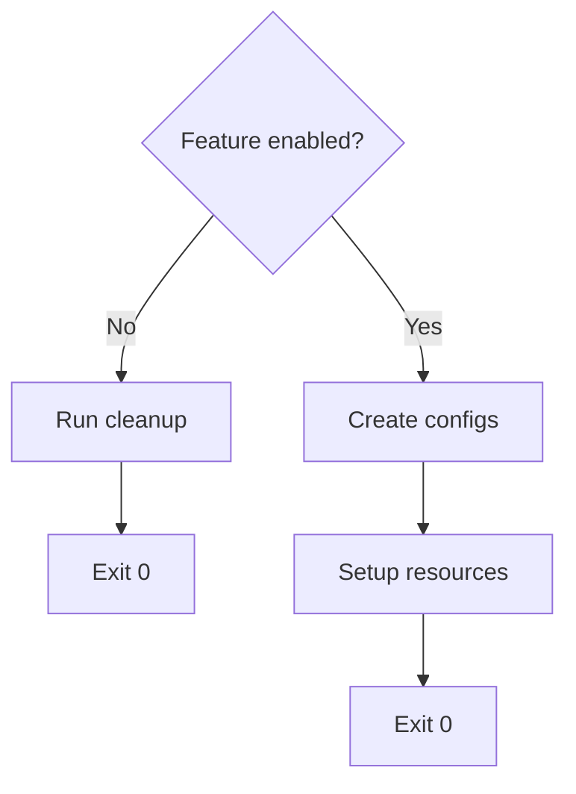

# OpenClaw Container Documentation

This documentation is bundled with the container at `/docs` so AI agents can understand how the system works and make informed modifications.

## How This Works

1. **Base Image** - The Dockerfile builds the base container with all dependencies
2. **rootfs Overlay** - Files in `rootfs/` are copied over the container filesystem
3. **Persistence** - Changes to `/etc`, `/root`, `/home`, `/data` are backed up via Restic
4. **Upgrades** - Agents can modify the overlay, deploy, and merge changes with persisted state

## For AI Agents

When modifying this container:

- Read these docs to understand the current architecture
- Add to docs as you make changes
- Make changes to `rootfs/` files (they overlay the base container)
- Changes to `/etc/cont-init.d/` run on every boot
- Changes to `/etc/services.d/` define long-running services
- Use `permissions.yaml` for file permissions, not inline chmod/chown
- Test with `make rebuild` before deploying

## Documentation Index

| File                                             | Description                                        |
| ------------------------------------------------ | -------------------------------------------------- |
| [system-architecture.md](system-architecture.md) | s6-overlay, boot sequence, services, upgrades      |
| [environment.md](environment.md)                 | How environment variables are persisted and loaded |
| [permissions.md](permissions.md)                 | File permission management via YAML config         |
| [user-access.md](user-access.md)                 | Users and the openclaw wrapper                     |
| [ssh.md](ssh.md)                                 | SSH configuration, local access, key rotation      |

## Key Directories

| Path                 | Purpose                                      | Persisted |
| -------------------- | -------------------------------------------- | --------- |
| `/etc/cont-init.d/`  | Init scripts (run on boot)                   | Yes       |
| `/etc/services.d/`   | s6 service definitions                       | Yes       |
| `/etc/digitalocean/` | Config files (backup.yaml, permissions.yaml) | Yes       |
| `/etc/ssh/`          | SSH configuration                            | Yes       |
| `/data/.openclaw/`   | OpenClaw state and config                    | Yes       |
| `/home/openclaw/`    | OpenClaw user home (nvm, pnpm)               | Yes       |
| `/home/ubuntu/`      | Ubuntu user home (SSH keys)                  | Yes       |

## Upgrade Workflow

When a new version of the base image is deployed:

1. Container starts with new base image
2. Restic restores persisted state from backup
3. Init scripts run, merging new defaults with existing configs
4. New code from rootfs is not applied over existing configs, they must be diffed to account for user changes
5. Services start with the combined configuration

Agents should design init scripts to handle this merge gracefully - check for existing config before overwriting, use sensible defaults, and log what changed.

## Init Script Best Practices

### Always Clean Up When Disabled

If your feature can be toggled via environment variable, **always clean up resources when disabled**:

```bash
#!/command/with-contenv bash

cleanup() {
  rm -f /etc/myfeature/config.conf
  rm -f /etc/cron.d/myfeature
  echo "[myfeature] Cleanup complete"
}

if [ "${MYFEATURE_ENABLE:-false}" != "true" ]; then
  echo "[myfeature] Disabled, cleaning up..."
  cleanup
  exit 0
fi

# Feature is enabled, do setup...
```

This ensures:
- No stale config from previous runs
- Clean state when user disables a feature
- No security exposure from leftover configs

### Pattern: Enable/Disable with Cleanup



### Other Guidelines

- Use a `cleanup()` function to DRY repeated cleanup logic
- Log what you're doing: `echo "[myfeature] Setting up..."`
- Exit with appropriate codes (0 = success, 1 = error)
- Handle errors gracefully: `rm -f file || { echo "Error"; exit 1; }`
