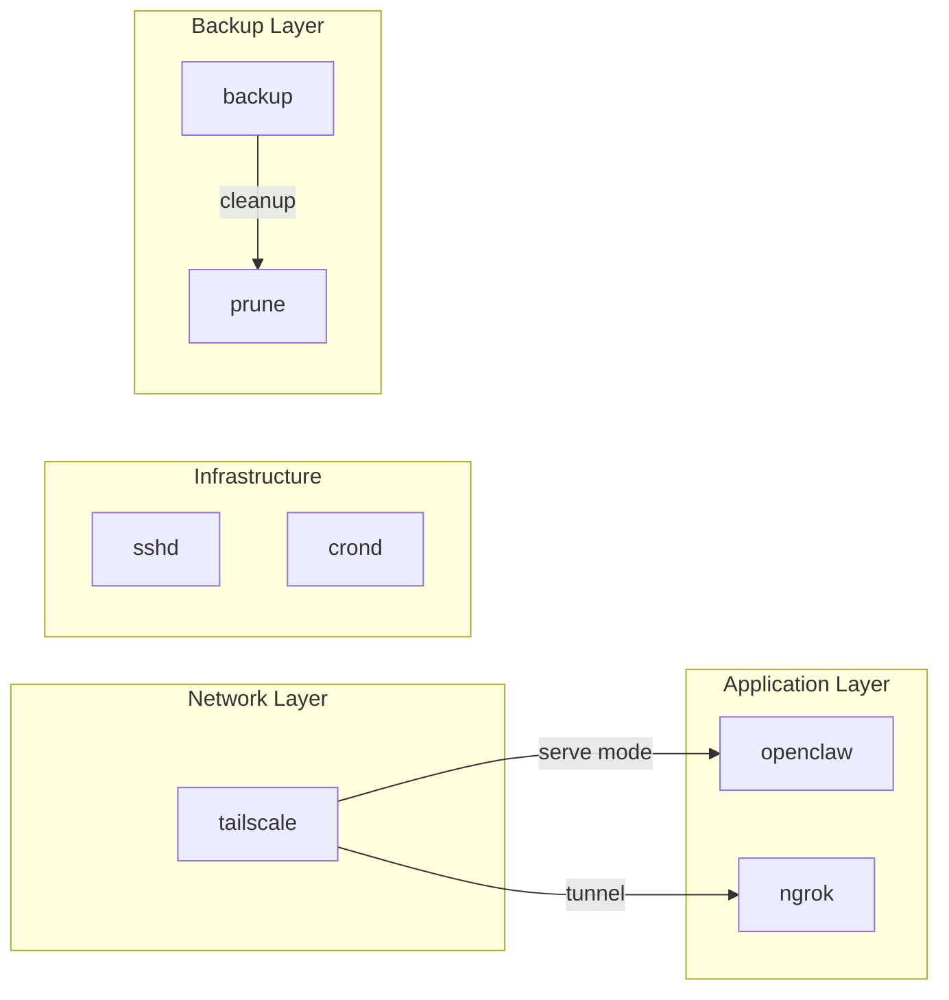

# System Architecture

How the OpenClaw container is built, boots, and manages services using s6-overlay.

## Overview

```mermaid
flowchart TD
    A[Docker starts container] --> B[/init entrypoint]
    B --> C[cont-init.d scripts]
    C --> D[services.d starts]
    D --> E{Container running}
    E -->|Stop signal| F[cont-finish.d scripts]
    F --> G[Container exits]
```

## s6-overlay

[s6-overlay](https://github.com/just-containers/s6-overlay) is a process supervisor designed for containers. It provides:

- **Init scripts** - Run once at container start (`/etc/cont-init.d/`)
- **Services** - Long-running processes (`/etc/services.d/`)
- **Finish scripts** - Run at container stop (`/etc/cont-finish.d/`)
- **Environment** - Persistent env vars (`/run/s6/container_environment/`)

### Boot Sequence

```mermaid
flowchart LR
    subgraph init["/init"]
        direction TB
        subgraph cont["cont-init.d (sequential)"]
            A1[00-persist-env-vars] --> A2[00-setup-tailscale]
            A2 --> A3[05-setup-restic]
            A3 --> A4[06-restore-packages]
            A4 --> A5[10-restore-state]
            A5 --> A6[11-reinstall-brews]
            A6 --> A7[12-ssh-import-ids]
            A7 --> A8[13-setup-ssh-local]
            A8 --> A9[20-setup-openclaw]
            A9 --> A10[99999-apply-permissions]
        end
    end
    init --> services
    subgraph services["services.d"]
        S1[tailscale] --> S2[openclaw]
        S1 --> S4[ngrok]
        S3[sshd]
        S5[backup] --> S6[prune]
        S7[crond]
    end
```



### Service Dependencies



| Service | Depends On | Notes |
| ------- | ---------- | ----- |
| `tailscale` | - | Starts first, provides networking |
| `openclaw` | `tailscale` | Waits for Tailscale serve mode |
| `ngrok` | `tailscale` | Optional tunnel, needs network |
| `sshd` | - | Independent |
| `backup` | - | Runs after restic init script |
| `prune` | `backup` | Cleans up after backups run |
| `crond` | - | Independent |

### Naming Convention

Init scripts are numbered to control execution order:
- `00-09` - Environment setup, early initialization
- `10-19` - State restoration, recovery
- `20-29` - Application configuration
- `30-89` - User customizations (add your scripts here)
- `99999` - Final permissions (always runs last)

## Service Management

### s6 Commands

| Command | Purpose |
| ------- | ------- |
| `/command/s6-svok /run/service/<name>` | Check if service is running (exit code 0 = up) |
| `/command/s6-svc -r /run/service/<name>` | Restart service |
| `/command/s6-svc -d /run/service/<name>` | Stop service (down) |
| `/command/s6-svc -u /run/service/<name>` | Start service (up) |
| `/command/s6-svc -Od /run/service/<name>` | Stop and mark as "once" (don't auto-restart) |

### Checking Service Status

```bash
# Check if a service is running
if /command/s6-svok /run/service/openclaw; then
  echo "OpenClaw is running"
fi

# Check multiple services
for svc in tailscale openclaw sshd; do
  if /command/s6-svok /run/service/$svc 2>/dev/null; then
    echo "$svc: up"
  else
    echo "$svc: down"
  fi
done
```

## Example Use Cases

### Adding a Custom Service

Create `/etc/services.d/myservice/run`:

```bash
#!/command/with-contenv bash
source /etc/s6-overlay/lib/env-utils.sh
source_env_prefix MYSERVICE_

if [ "${MYSERVICE_ENABLE:-false}" != "true" ]; then
  echo "[myservice] Disabled"
  s6-svc -Od .
  exit 0
fi

exec myservice --config /etc/myservice.conf
```

### Adding an Init Script

Create `/etc/cont-init.d/30-my-setup`:

```bash
#!/command/with-contenv bash

echo "[my-setup] Configuring..."

# Check if a service will be available
if [ "${ENABLE_TAILSCALE:-false}" = "true" ]; then
  echo "[my-setup] Tailscale enabled, configuring integration..."
fi
```

### Service with Dependency

Create `/etc/services.d/myservice/dependencies.d/tailscale` (empty file) to declare dependency:

```bash
# The file just needs to exist
touch /etc/services.d/myservice/dependencies.d/tailscale
```

Or check at runtime in your run script:

```bash
#!/command/with-contenv bash

# Wait for tailscale to be ready
timeout=60
while ! /command/s6-svok /run/service/tailscale 2>/dev/null; do
  sleep 1
  ((timeout--))
  if [ $timeout -le 0 ]; then
    echo "[myservice] Tailscale not ready, exiting"
    exit 1
  fi
done

exec myservice
```

## Upgrade Path

When deploying a new container image version:

### What Happens

1. **New image deploys** - Base container has updated files
2. **Restic restores state** - `/etc`, `/home`, `/root`, `/data` restored from backup
3. **Init scripts run** - Merge new defaults with existing config
4. **Services start** - Combined configuration takes effect

### Handling Config Changes

Init scripts should handle upgrades gracefully:

```bash
#!/command/with-contenv bash
# Example: Add new config option without overwriting user changes

CONFIG="/etc/myapp/config.yaml"

# Only set default if key doesn't exist
if ! grep -q "new_option:" "$CONFIG" 2>/dev/null; then
  echo "new_option: default_value" >> "$CONFIG"
  echo "[myapp] Added new_option with default"
fi
```

### Breaking Changes

For breaking changes, version your config:

```bash
#!/command/with-contenv bash
CONFIG="/etc/myapp/config.yaml"
CONFIG_VERSION=$(yq '.version // 0' "$CONFIG")

if [[ "$CONFIG_VERSION" -lt 2 ]]; then
  echo "[myapp] Migrating config from v$CONFIG_VERSION to v2..."
  # Perform migration
  yq -i '.version = 2' "$CONFIG"
fi
```

### Testing Upgrades

1. Make changes to `rootfs/` in the repo
2. Build and test locally: `make rebuild`
3. Deploy to staging environment
4. Verify state restoration works correctly
5. Deploy to production

## Persistence

### What's Backed Up

Restic backs up these paths (configured in `/etc/digitalocean/backup.yaml`):

| Path | Contents |
| ---- | -------- |
| `/etc` | System config, init scripts, services |
| `/root` | Root user home |
| `/home` | All user homes (ubuntu, openclaw) |
| `/data/.openclaw` | OpenClaw state and config |
| `/data/tailscale` | Tailscale state |

### Backup Schedule

- **Backup**: Every 30 seconds (incremental)
- **Prune**: Every hour (cleanup old snapshots)
- **Restore**: Automatic on container start

### Manual Backup/Restore

```bash
# Force immediate backup
/command/s6-svc -r /run/service/backup

# List snapshots
source /etc/s6-overlay/lib/env-utils.sh
source_env_prefix RESTIC_
restic snapshots

# Restore specific path from latest
restic restore latest --target / --include /etc/myconfig
```

## Related Documentation

- [environment.md](environment.md) - Environment variable management
- [permissions.md](permissions.md) - File permission configuration
- [user-access.md](user-access.md) - User accounts and SSH access
