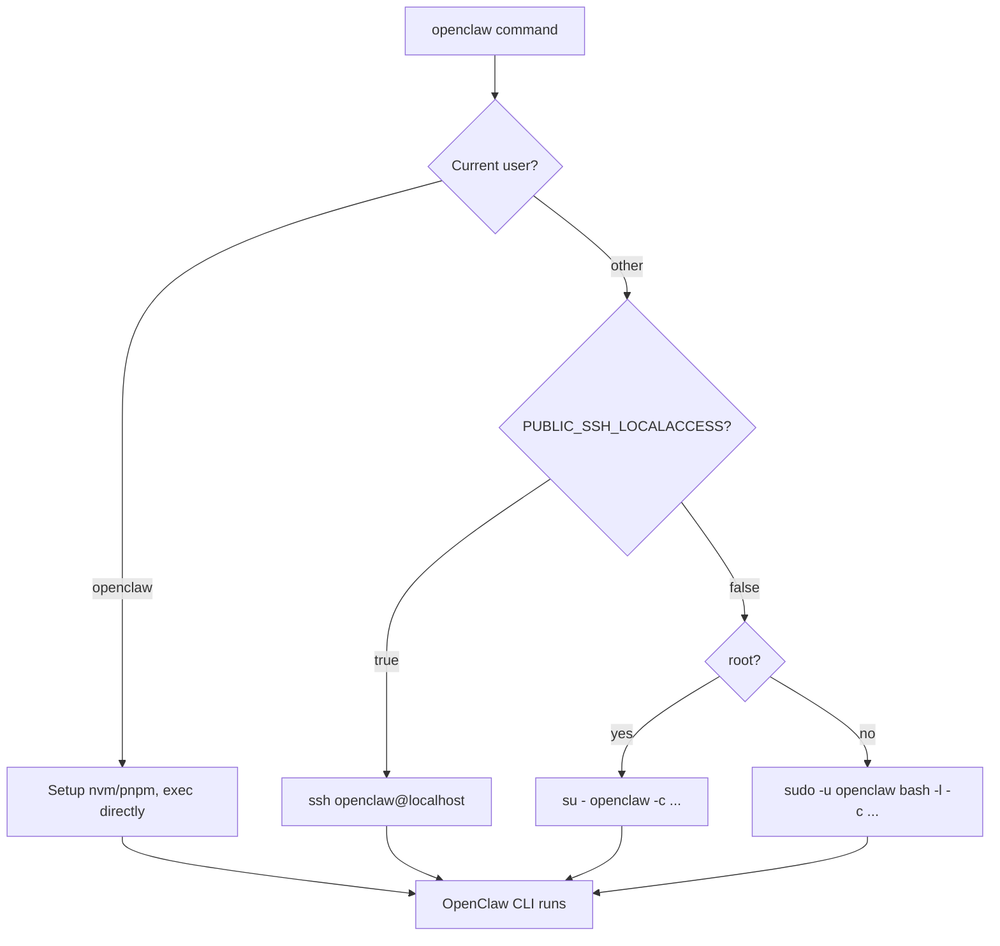

# User Access

How to access and work with different users in the OpenClaw container.

## Users

The container has three main users:

| User       | Purpose                                    | Home Directory     |
| ---------- | ------------------------------------------ | ------------------ |
| `root`     | System administration, service management  | `/root`            |
| `ubuntu`   | Default console user, SSH key management   | `/home/ubuntu`     |
| `openclaw` | Runs OpenClaw gateway, owns state files    | `/home/openclaw`   |

## Console Access

When you attach to the container console (e.g., via App Platform), you land as the `ubuntu` user. From there you can:

```bash
sudo -i                    # Switch to root
ssh openclaw@localhost     # SSH to openclaw user (see ssh.md)
ssh root@localhost         # SSH to root (see ssh.md)
```

For SSH configuration details, see [ssh.md](ssh.md).

## The openclaw Wrapper

The wrapper at `/usr/local/bin/openclaw` runs OpenClaw commands as the `openclaw` user with proper environment.

### Why It Exists

The OpenClaw CLI needs:
- To run as the `openclaw` user (owns state files)
- Node.js via nvm (installed in openclaw's home)
- pnpm global binaries in PATH
- OPENCLAW_* environment variables

### Usage

```bash
# From any user (root, ubuntu, or openclaw)
openclaw channels login
openclaw gateway health --url ws://127.0.0.1:18789
openclaw --help
```

### How It Works



1. Sources OPENCLAW_* and SSH_* environment variables
2. If already `openclaw` user: sets up nvm/pnpm and runs directly
3. If `PUBLIC_SSH_LOCALACCESS=true`: uses local SSH to openclaw@localhost
4. If `root`: uses `su - openclaw` to switch with login shell
5. If other user: uses `sudo -u openclaw bash -l` to switch

### Local SSH Mode

Set `PUBLIC_SSH_LOCALACCESS=true` to make the wrapper use local SSH by default:

```bash
# In environment or .env
PUBLIC_SSH_LOCALACCESS=true
```

Then `openclaw` commands transparently SSH to openclaw@localhost:

```bash
openclaw channels login  # Uses local SSH under the hood
```

This is useful for:
- Remote access where sudo may not be configured
- Environments without sudo installed
- Consistent behavior across different access methods

The wrapper also auto-detects if sudo is unavailable and falls back to local SSH.

### Do Not Run Directly

```bash
# Wrong - missing environment and wrong user
/home/openclaw/.local/share/pnpm/openclaw channels login

# Correct - uses wrapper
openclaw channels login
```

## For AI Agents

When working inside the container:

1. **Attach to console** - You land as `ubuntu` user
2. **SSH to openclaw** - `ssh openclaw@localhost` for proper environment
3. **Make changes** - Edit files, test configurations
4. **Restart services** - `/command/s6-svc -r /run/service/<name>`

Changes to `/etc`, `/home`, `/root`, `/data` are automatically backed up. On next deploy, these changes merge with the new base image.

**Example: Modifying OpenClaw config**
```bash
ssh openclaw@localhost
vim /data/.openclaw/openclaw.json
exit
/command/s6-svc -r /run/service/openclaw
```

## Related Files

- `/usr/local/bin/openclaw` - OpenClaw wrapper script

For SSH-related files, see [ssh.md](ssh.md#related-files).
